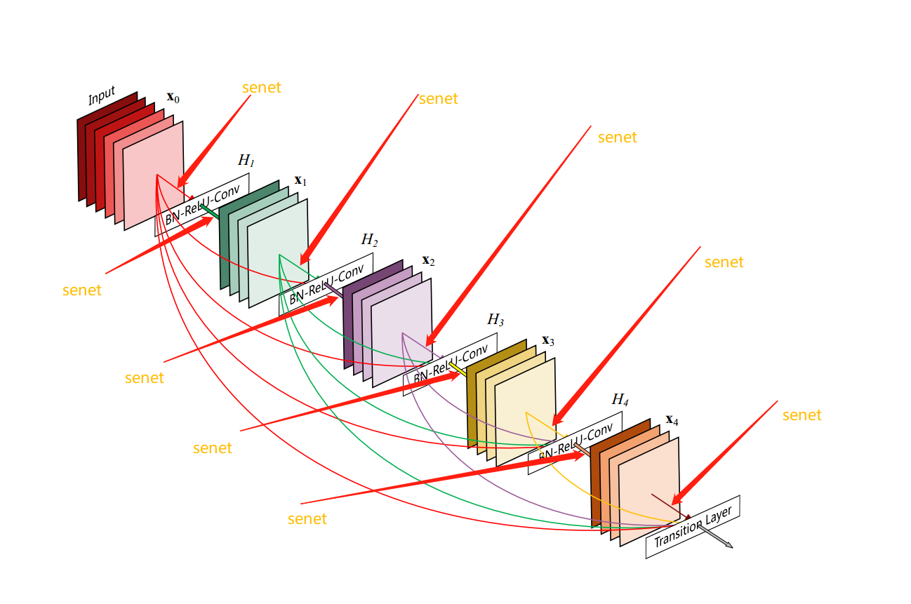
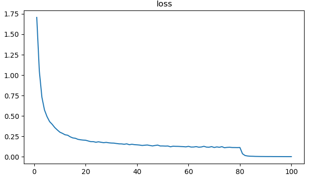
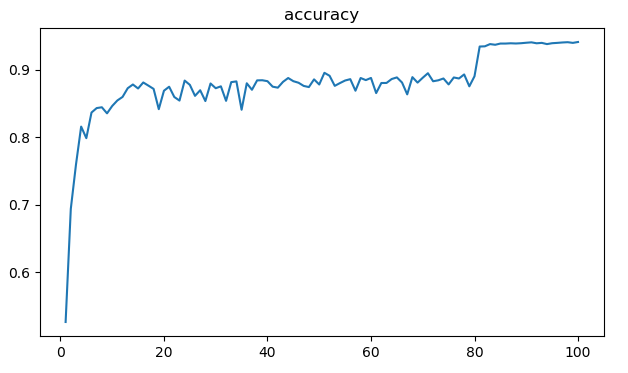
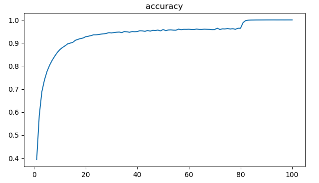
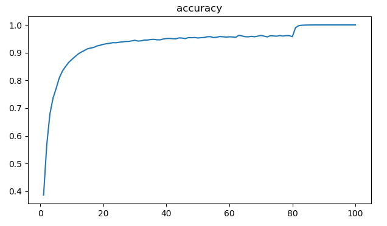
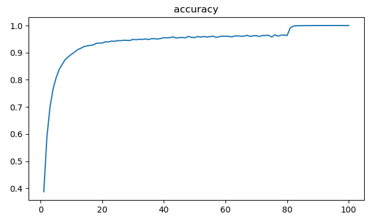
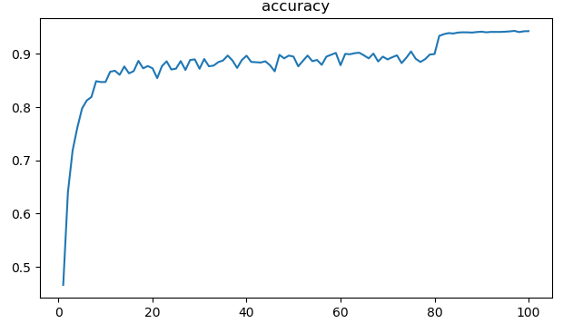
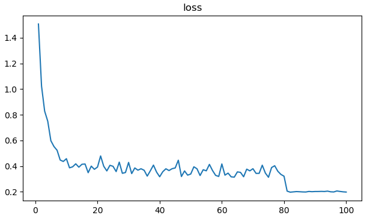

# SE_DenseNet

## Introduction


This is a DensNet  which contains a [SE](https://arxiv.org/abs/1709.01507) (Squeeze-and-Excitation Networks by Jie Hu, Li Shen and Gang Sun) module.

Densenet as backbone, I just add senet module into densenet as pic shows below, but it's not the whole structure of se_densenet. 



 Click my **[blog](http://www.zhouyuangan.cn/2018/11/se_densenet-modify-densenet-with-champion-network-of-the-2017-classification-task-named-squeeze-and-excitation-network/)**  if you want to know more edited se_densenet details.

 And Chinese bersion blog is at [here](https://zhuanlan.zhihu.com/p/48499356)

## Usage

For test se_densenet
```
python se_densenet.py
```
And it will print structure of se_densenet.

Let's input an tensor which shape is (32, 3, 224, 224) into se_densenet

```
python test_se_densenet.py
```
 Of course, it will print ``torch.size(32, 1000)``

## Train code had been released(updated!)
If you want to try another structure, I think this training code will help you. Please check [here](https://github.com/zhouyuangan/mixed-senet-densenet) for more details

## Test and result on my dataset

### Densenet

- train


- val


The best acc is: 98.5417%

### Se_densenet

- train


- val


The best acc is: 98.6154%

### Table

|network|best train acc|best val acc|
|--|--|--|
|``densenet``|0.966953|0.985417|
|``se_densenet``|**0.967772**|**0.986154**|

``Se_densenet`` has got **0.0737%** higher accuracy than ``densenet``. I didn't train and test on public dataset like cifar and coco, because of low capacity of machine computation, you can train and test on cifar or coco dataset by yourself if you have the will.

## Update

## Test and result on Cifar dataset

### [Densenet](https://github.com/zhouyuangan/SE_DenseNet/blob/master/baseline.py) (baseline)

- Train



- val



The best val acc is 0.9406 at epoch 98

### Se_densenet_w_block

In this part, I removed some selayers from densenet' ``transition`` layers, pls check [se_densenet_w_block.py](https://github.com/zhouyuangan/SE_DenseNet/blob/master/se_densenet_w_block.py) and you will find some commented code which point to selayers I have mentioned above.

- train




- val


The best acc is 0.9381 at epoch 98.

### Se_densenet_full

Pls check [se_densenet_full.py](https://github.com/zhouyuangan/SE_DenseNet/blob/master/se_densenet_full.py) get more details, I add senet into both denseblock and transition, thanks for [@john1231983](https://github.com/John1231983)'s issue, I remove some redundant code in se_densenet_full.py, check this [issue](https://github.com/zhouyuangan/SE_DenseNet/issues/1) you will know what I say, here is train-val result on cifar-10:

- train




- val


The best acc is 0.9407 at epoch 86.

### se_densenet_full_in_loop

Pls check (se_densenet_full_in_loop.py)[https://github.com/zhouyuangan/SE_DenseNet/blob/master/se_densenet_full_in_loop.py] get more details, and this [issue](https://github.com/zhouyuangan/SE_DenseNet/issues/1#issuecomment-438891133) illustrate what I have changed, here is train-val result on cifar-10:

- train




- val




The best acc is 0.9434 at epoch 97.

### table

|network|best val acc|epoch|
|--|--|--|
|``densenet``|0.9406|98|
|``se_densenet_w_block``|0.9381|98|
|``se_densenet_full``|0.9407|**86**|
|``se_densenet_full_in_loop``|**0.9434**|97|

### Conclusion

According to my test result, ``se_densenet_full_in_loop`` performs the best accuracy, and ``se_densenet_full`` performs the best because of less epoch at 86, ``se_densenet_full`` gets ``0.9407`` accuracy higher than others' but except ``se_densenet_full_in_loop``,``se_densenet_full_in_loop`` gets the best,  and it costs less time to get the best accuracy at ``86`` epoch. In the contrast, both ``densenet`` and ``se_densenet_w_block`` get their own the highest accuracy are ``98`` epoch.

## TODO

I will release my train code on github as quickly as possible.

- [x] Usage of my codes
- [x] Test result on my own dataset
- [x] Train and test on ``cifar-10`` dataset
- [x] Release train and test code, [repository](https://github.com/zhouyuangan/mixed-senet-densenet)
