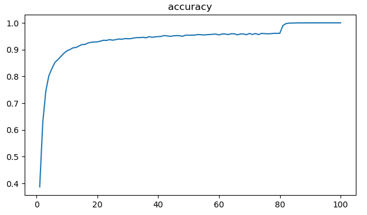
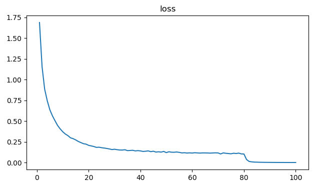

# SE_DenseNet

## Introduction


This is a DensNet  which contains a [SE](https://arxiv.org/abs/1709.01507) (Squeeze-and-Excitation Networks by Jie Hu, Li Shen and Gang Sun) module.

The backbone is densenet, I just add senet into densenet as pic shows, but it's not whole stucture of se_densenet, please check **[blog](http://www.zhouyuangan.cn/2018/11/se_densenet-modify-densenet-with-champion-network-of-the-2017-classification-task-named-squeeze-and-excitation-network/)** you will get more details on se_densenet, and then I will test se-densenet on my own classification task and dataset compares with performance of densenet.


 Click my **[blog](http://www.zhouyuangan.cn/2018/11/se_densenet-modify-densenet-with-champion-network-of-the-2017-classification-task-named-squeeze-and-excitation-network/)**  if you want to know more edited se_densenet details.

## Usage

For test se_densenet
```
python se_densenet.py
```
And it will print structure of se_densenet.

Let's input an tensor which shape is (32, 3, 224, 224) into se_densenet

```
python test_se_densenet.py
```
 Of course, it will print ``torch.size(32, 1000)``

## Test and result on my dataset

### Densenet

- train


- val


The best acc is: 98.5417%

### Se_densenet

- train


- val


The best acc is: 98.6154%

### Table

|network|best train acc|best val acc|
|--|--|--|
|densenet|0.966953|0.985417|
|se_densenet|**0.967772**|**0.986154**|

Se_densenet has got **0.0737%** higher accuracy than densenet. I don't train and test on public dataset like cifar and coco, because of low capacity of machine computation, you can train and test on cifar or coco dataset by yourself if you have the will.

## Update

## Test and result on Cifar dataset

### [Densenet](https://github.com/zhouyuangan/SE_DenseNet/blob/master/baseline.py) (baseline)

- Train



- val


The best val acc is 0.9406 at epoch 98

### Se_densenet_w_block

In this part, I removed some selayers from densenet' ``transition`` layers, pls check [se_densenet_w_block.py](https://github.com/zhouyuangan/SE_DenseNet/blob/master/se_densenet_w_block.py) and you will find some commented code which point to selayers I have mentioned above.

- train




- val


The best acc is 0.9381 at epoch 98.

### Se_densenet_full

Pls check [se_densenet_full.py](https://github.com/zhouyuangan/SE_DenseNet/blob/master/se_densenet_full.py) get more details, I add senet into both denseblock and transition, thanks for [@john1231983](https://github.com/John1231983)'s issue, I remove some redundant code in se_densenet_full.py, check this [issue](https://github.com/zhouyuangan/SE_DenseNet/issues/1) you will know what I say, here is train-val result on cifar-10:

- train


- val


The best acc is 0.9407 at epoch 86.

### table

|network|best val acc|epoch|
|--|--|--|
|``densenet``|0.9406|98|
|``se_densenet_w_block``|0.9381|98|
|``se_densenet_full``|**0.9407**|**86**|

### Conclusion

According to my test result, se_densenet_full performs best actually, se_densenet_full gets ``0.9407`` accuracy higher than others', and it cost less time to get best accuracy at ``86`` epoch, in the contrast, both ``densenet`` and ``se_densenet_w_block`` get their own higher accuracy are ``98`` epoach.

## TODO

I will release my train code on github as quickly as possible.

- [x] Usage of my codes
- [x] Test result on my own dataset
- [x] Train and test on ``cifar-10`` dataset
- [ ] Release train and test code
